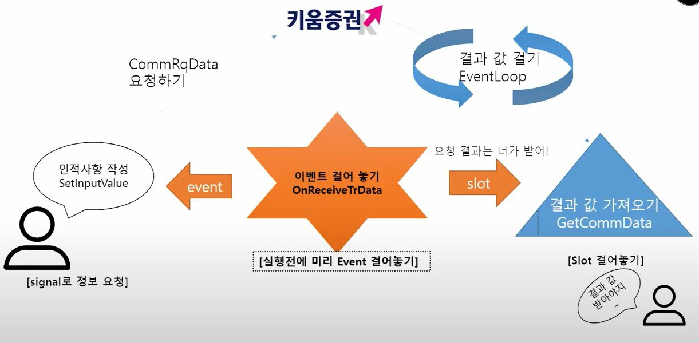
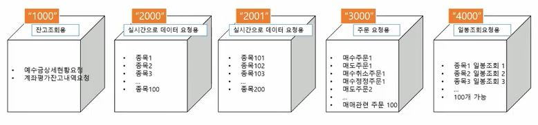
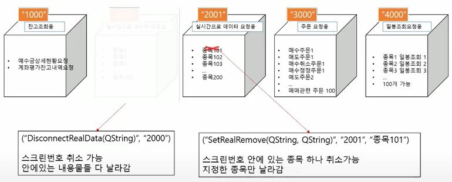

# KATrader

## 한국어
## 배경지식
### THREAD (쓰레드)
쓰레드를 이용하면 상대적으로 긴 I/O 과정 동안 통신, 데이터 처리와 관련된 일을 병렬적으로 처리할 수 있어 효율적인 프로그램 동작을 보장한다. 만약 Single Tread만을 사용한다고 가정하면 I/O에 대한 동작이 완료되는 동안 프로그램이 동작하지 않아 원하는 기능을 보장받지 못 할 수 있다.  
  
이때 사용되는 개념으로 Event-Loop가 있다. Single Thread 기반 EventLoop을 생성하는 방법은 다음과 같은 과정을 거친다.   

1. API를 사용해 **특정 요청** (ex: 특정 종목에 대한 주가 요청)에 대한 **처리**를 외부 서버에 전달
2. **서버로부터 동작 종료 시그널을 받아** 해당 정보를 수신
3. **Callback Queue**는 Task에 작업이 없을 때, 서버의 명령 처리 종료 시그널을 Task에 보내 다른 작업을 막고, 이어 요청했던 정보를 수신

서버에 요청하는 작업이 아닌 다른 명령들은 즉시 Task에서 처리가 가능하기 때문에 Single Thread만으로 MultiThread를 사용하는 효과를 누릴 수 있다.  
  
여기서 Event-Loop이란 Task 구역에 처리할 데이터가 없을 때, 즉 할당된 일이 없을 때, Callback Queue에 쌓인 동작들을 하나씩 전달되어 실행하는 일련의 과정을 뜻한다. 이 Eventloop 생성은 매우 복잡하게 구현되는데, **PyQt5**에서는 *QEventLoop()* 하나로 간단하게 구현해 놓았다.  
  
### PyQt5: QEventLoop()
`QEventLoop()` 은 요청한 작업이 끝날 때까지 다른 작업을 허용하지 않는다. 즉, block 기능을 가지고 있어 `.exit()` 을 이용해 루프를 수동으로 종료시켜야 한다. 이 block을 통해 다음 코드 진행에 의한 비정상적인 동작 발생을 방지한다.

### Slot
슬롯(Slot)이란 Eventloop에서 시그널이 발생했을 때, 해당 이벤트에 대해 동작을 수행하는 것을 말한다. 간단하게, 이벤트(요청, Request)에 대한 동작이 정의된 함수라고 생각할 수 있다. 

### TR

로그인과 마찬가지로 TR에 대한 EventLoop을 생성할 수 있다. 다음과 같이 OnReceiveTrData를 이용한다. `OnReceiveTrData.connect(slot구역)` 을 이용하여 TR데이터를 수신할 때의 Slot을 지정할 수 있다. 해당 이벤트 루프는 Slot에 다음과 같은 정보를 전달한다.

```
void OnReceiveTrData(
          BSTR sScrNo,       // 화면번호
          BSTR sRQName,      // 사용자 구분명
          BSTR sTrCode,      // TR이름
          BSTR sRecordName,  // 레코드 이름
          BSTR sPrevNext,    // 연속조회 유무를 판단하는 값 0: 연속(추가조회)데이터 없음, 2:연속(추가조회) 데이터 있음
          LONG nDataLength,  // 사용안함.
          BSTR sErrorCode,   // 사용안함.
          BSTR sMessage,     // 사용안함.
          BSTR sSplmMsg     // 사용안함.
          )
```

위의 그림을 순서대로 요약해 설명하면 다음과 같다.
1. EventLoop를 설정한다.
2. CommRqData를 통해 요청한다.
3. Slot을 정의하여 데이터를 처리한다.

### Screen Number (스크린 번호)

스크린 번호는 다음과 같은 Grouping 기능을 지원한다. 하나의 그룹을 만들어 비슷한 기능, 성격을 가진 객체들끼리 동작하도록 지원한다. 이때, 각각의 화면번호 당 100개의 동작을 지원하며, 이러한 화면번호는 200개까지 생성할 수 있다. 따라서 2만 (100 * 200)개를 가져올 수 있다.  


이러한 그룹화를 이용해 실시간 정보를 수신/수신해제 할 수 있다. 위의 그림에서처럼 모든 화면번호를 모두 연결해제하거나 종목 하나만을 연결 해제하는 것이 가능하다.


## 참조
- [Multiple Widget](https://www.learnpyqt.com/tutorials/creating-multiple-windows/)
- [Automatic Trading System Implementation](https://www.youtube.com/channel/UCq7fsrxP6oi6vnYgPkw92jg)
<br></br>

## TODO
- [ ] Logger
- [ ] GUI
